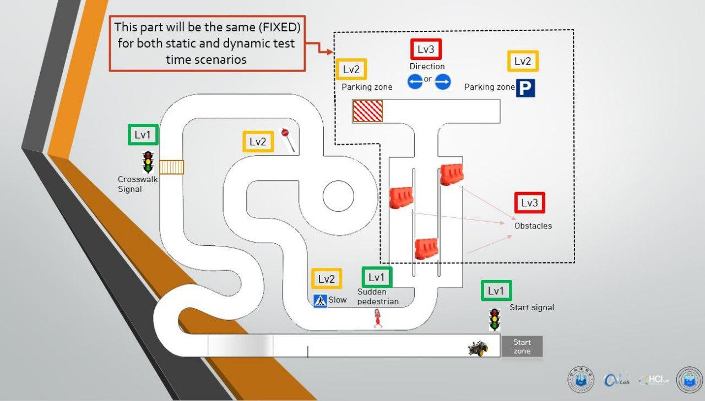

### Capstone Design Autonomus Car Model Documentation

For full documentation visit [Docs](https://github.com/tdoston/autonomus-car-model/docs).

### Overview

  

### Smart car algorithms (Whole mission)

  

  

  

<table style="width:100%">
  <tr>
    <th>
      

           
            Basic Lane Finding
            <a href="unit_tests/line-obstacle-ir-sensors.py" name="p1_code">(code)</a>
      

    </th>
    <th>
        

           
            P2: Traffic Light Detection
            <a href="recognition.py" name="p2_code">(code)</a>
        

    </th>
  </tr>
  
  <tr>
      <th>
        

           
           
            P3: Obstacle detection
            <a href="unit_tests/line-obstacle-ir-sensors.py" name="p3_code">(code)</a>
        

    </th>
    <th>
        

           
           
            P4: Traffic signs detection
            <a href="sign_cascade.py" name="p4_code">(code)</a>
        

    </th>

</table>

### All control cases when sensors and image detect desired things

 `[][][][][][]` - possible **6** command signals and to control motors

> `[]` - every cell could be `1` or `0`
> That means we have `2`x`2`x`2`x`2`x`2`x`2` = **64** cases

* **`Rl`** **`Ll`**`[0][0][0][0]`       : R - right IR signal, L- left IR signal for **lane** detection
* `[0][0]`**`Ro`** **`Lo`** `[0][0]`    : Ro - right IR signal, Lo- left IR signal for **obstacle** detection
* `[0][0][0][0]` **`Rc`** **`Lc`**       : Rc - lane curve right, Lo- lane curve left by __camera__  **image processing**

#
All the set of cases **goForward**, **turnRight**, **turnLeft**, **backAndLeft**, **backAndRight** in  `allcases.py`

        forward = "000000"
        camera_right = "000010"
        camera_left = "000001"
        
        right = {
            "001000",
            "001001",
            "001010",
        
            "100000",
            "100001",
            "100010",
        
            "101000",
            "101001",
            "101010",
        
            # "111000",
            # "111001",
            # "111010"
        }
        
        left = {
            "010010",
            "000100",
            "000101",
        
            "000110",
            "010001",
            "010100",
        
            "010000",
            "010101",
            "010110",
        
            # "110100",
            # "110101",
            # "110110"
        }
        
        double_line = {
            #right
            "111000",
            "111001",
            "111010"
            #left
            "110100",
            "110101",
            "110110"
        }
        
        
        back_right = {
            "001100",
            "001101",
            "001110"
            
            "011100",
            "011101",
            "011110",
        }
        
        back_left = {
            "101100",
            "101101",
            "101110",
        }
        
        
        back_turn_left = {
            "100100"
            "100101",
            "100110"
        }
        
        back_turn_right = {
            "011000"
            "011001",
            "011010"
        }
    

### Multiple turning types
We decide to make different turning modes for different commands
* When **IR sensor** send turn righ/left
signal that mean ahead Obstacle, it requires __radical turn__

* When **Camera Image Processing** send turn right/left command
that mean ahead `curved turn` then __turn smoothly__
we use for smooth turn different [PWM](https://en.wikipedia.org/wiki/Pulse-width_modulation) values for two different sides motors

### Commands

* `python3 main.py` - Run the project.

### Project layout
   
    mkdocs.yml    # The configuration file.
    docs/
        index.md  # The documentation homepage.
        ...       # Other markdown pages, images and other files.
    unit_tests/
        line-obstacle-ir-sensors.py # The unit test script.
        test.md  # The documentation unit tests.
    xml_signs/
        cascade_girl_pedestrian  # The documentation homepage.
        ...       # Other trained xml files.

